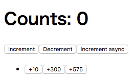

# nightmarejs-e2e-sample [](https://travis-ci.org/airtoxin/nightmarejs-e2e-sample)

E2E test sample repository using Nightmare.js

## とりあえず実行する

0. `npm install`
0. `npm run test:e2e`

## Documents

### 序文

E2EテストといえばSeleniumですが起動までの準備が大変だったりAPIに癖があったりとなかなか苦労する事も多いです。  
そんな感じなのでテスト自体のメンテナンスコストが高く、結局UIテストはテスト項目書を作って手動で行うみたいになりがちです。  

でもエンジニアなら自動化したい……。  

そこで使ってみてほしいのが今回の[`Nightmare.js`](http://www.nightmarejs.org/)です。  
Nightmare.jsはElectronをベースにしたブラウザ自動化ツールです。  
ElectronなのでChromeでテストをしている感覚で扱え、ハマりどころも比較的少ないのでストレスが低くE2Eテストが出来るものになっています。  

Nightmare.js自体は結構前からあり昔はヘッドレスブラウザのPhantomJSをベースに動作していましたが、  
その頃はPhantomJS自体のバグや、モダンブラウザとの動作の乖離などでなかなか扱いづらい物でした。  
現在のElectronはChromiumベースとなっているので、少なくともChromeでの動作テストは行えるようになっています。  

今回は簡単ですがカウンターアプリのテストを行うというストーリーでやっていきます。  
アプリは`npm install`した後に`npm start`を実行するとlocalhost:9000に起動します。  



### テストの実行

E2Eテストは`npm run test:e2e`で実行できます。  
今回は開発中のアプリケーションに対してもテスト実行を行いたかったので、ローカルでサーバーを立てる処理を行ってからテストの実行をしています。  
デプロイ済みのアプリケーションに対して(本当の意味の)E2Eテスト的にCIなどでテスト実行したい場合は直接テストを実行すれば大丈夫です。  

### テストの書き方

テストランナーにはmochaを使っています。  
nightmareのインスタンスはPromiseライクな自身を返り値として持つapiを多数持っているので、promiseの解決を待った上でその成功可否をテストケースの結果としてくれるmochaと相性が良いです。  

```js
describe('nightmarejs-e2e-sample', () => {
  let page;
  beforeEach(() => {
    page = getNightmareInstance();
  });
  afterEach(done => {
    page.halt(null, done);
  });

  it('should show page', () => page
    .use(goto('/'))
    .title()
    .then(title => assert.strictEqual(title, 'nightmarejs-e2e-sample'))
  );
});
```

それぞれのテストケース毎にnightmareのインスタンス(ブラウザ)生成と破棄を行うようにします。  
__明示的にhaltを呼んでブラウザを止めてやらないとテストケース毎にブラウザが生成されてしまいます__  

## Nightmareインスタンスの操作

### インスタンスの生成(ブラウザの立ち上げ)

```js
import Nightmare from 'nightmare';
const page = Nightmare({オプション});
```

テストケース毎にブラウザの立ち上げ処理などを行う必要があるので、ヘルパー関数として纏めておくとオプションを毎回指定しなくても済みます。  

### インスタンスの破棄(ブラウザの終了)

```js
page.halt(error, done);
```

`error`は何もなく終了する場合は`null`、エラーが有る場合は文言を渡すと`Nightmare Halted`というメッセージの代わりにエラーが表示されます(mochaならそちらが勝手にエラーをハンドリングするのでnullで大丈夫)。  
`done`はブラウザ終了のコールバックです。

### ページの表示

```js
page.goto('https://www.google.co.jp/');
```

gotoメソッドではurl変更をするのみでドキュメントのロード完了などを待ってくれないので、その辺りはこれとは別に待ってやる必要があります。  

### 待機

```js
page.wait(1000); // 1秒待つ
page.wait('#app'); // 対象の要素が取れるようになるまで待つ
page.wait(() => window.myApplication.isReady()); // ブラウザ上で関数を実行した結果がtrueになるまで待つ
```

関数をwaitメソッドの引数に渡してやると、それの実行結果がtrueになるまで待機するようになります。  
jsでtrueと評価されるような値でも明示的にbooleanに変換してやらないといけなさそうなので注意が必要です。  
(`page.wait(() => !!window.maybeObject);`)  
また引数の関数はブラウザ上で実行されるので、テストケースなど実行側の変数をこの関数内で使用するにはwaitの引数にその変数を渡す必要があります。  
`page.wait(num => !!$('button:contains(+' + num + ')'), n)` (変数nを渡している)  

### ブラウザ上で任意コードの実行

```js
page.evaluate((num) => {
  window.mySlider.setValue(num);
  return null;
}, n);

page
  .evaluate(() => window.mySlider.getValue())
  .then(value => console.log(value)); // nと同じ値が表示される
```

evaluateメソッドでは引数に渡した関数をブラウザ上で実行し、その返り値を後続のthenで受け取れます。  
実際はelectronのipcを使っていると思われるので、関数の返り値として文字列や数値などシリアライズ可能なプリミティブな値を返してやる必要があります。  
こちらもwaitと同様に実行側の変数を使用するなら引数として渡してやる必要があります。  

### フォームに値を入力

```js
page.type('#myform', 'texttexttext');
page.insert('#myform', 'texttexttext');
```

typeとinsertどちらのメソッドも第一引数のセレクタで取れた要素に対して第二引数の文字列を入力します。  
typeメソッドでは入力は1文字づつ入力するのでそこそこ時間がかかりますが、それぞれでインプットイベントが発生するので忠実に入力の再現をしたいならtypeを使うのが良いかと思います。  
insertではイベントは発生しない代わりにDOMに対して直接文字列を挿入するので、大量の文言を入力する場合などはこちらのほうが高速に動作します。  

### jsファイルを挿入

```js
page.inject('js', `node_modules/jquery/dist/jquery.js`);
```

テストが楽に書けるようにjqueryが入っていないページにjqueryを挿入したりするのに使います。

### その他

https://github.com/segmentio/nightmare#api

## プラグイン機構

nightmareには一連の手続きを纏めたものをプラグインとして定義できます。  
これを使うことでテストケースの記述量が減って単純にテストケースが読みやすくなるのに加えて、  
ドメイン固有のUI操作に対して名付けができるようになるのでPageObjectパターンのように記述ができるようになります。  

```js
it('should increment +10, +300 and +575', () => page
  .use(goto('/'))
  .use(clickPlusN(10))
  .use(getCount())
  .then(count => assert.strictEqual(count, 10))
  .then(() => page
    .use(clickPlusN(300))
    .use(getCount())
    .then(count => assert.strictEqual(count, 10 + 300)))
  .then(() => page
    .use(clickPlusN(575))
    .use(getCount())
    .then(count => assert.strictEqual(count, 10 + 300 + 575)))
);
```

プラグインを使う場合は上記の様に`use`メソッドに対して手続きを纏めた関数を渡します。  
useに渡された関数には実行中のnightmareインスタンスが渡されるのでそれを使って処理を記述し、最後にまたnightmareインスタンスを返してやります。  

```js
function goto(path, waitFor = '[data-reactroot]') {
  return (nightmare) => nightmare
    .goto(url.resolve(BASE_URL, path))
    .inject('js', `node_modules/jquery/dist/jquery.js`)
    .wait(waitFor);
}

function clickIncrement() {
  return (nightmare) => nightmare
    .wait(() => !!$('button:contains("Increment")'))
    .evaluate(() => {
      $('button:contains("Increment")').click();
      return null;
    });
}
```

これによってテストケース記述時に意識する必要のないjqueryの挿入やアプリケーションの準備完了待ち等の処理を隠蔽できます。  
また動的なフォームなどを持つアプリケーションの場合には、要素をクリックする前にその要素が出現するのを待つ必要があるので、そのような処理を`要素をクリックする`というプラグインとして隠蔽してやるとスッキリすると思います。  

## CIでの実行

Dockerの`fentas/nightmare`イメージを使って

```bash
docker run --rm -i \
  -v `pwd`:`pwd`\
  -e "NODE_ENV=production" \
  -e "EXECUTE_E2E_HEADLESS=true" \
  fentas/nightmare \
  bash -c "cd `pwd` && xvfb-run npm run test:e2e"
```

のように実行します。  
実行時はNightmareのオプションでヘッドレス実行するようにしていますが、効果があるのかは不明。  

## License

MIT
